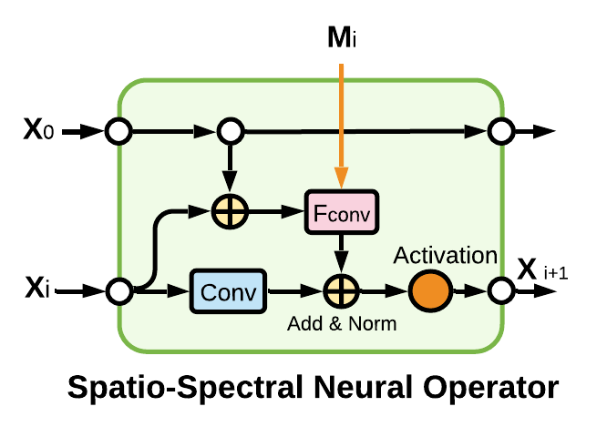

# SSNO: Spatio-spectral Neural Operator for Functional Space Learning of Partial Differential Equations

## Abstract:
Recent research to solve the parametric partial differential equations shifted the focus of conventional neural networks from finite-dimensional Euclidean space to generalized functional spaces. Neural operators learn the generalized function mapping directly, which was achieved primarily using numerical solvers for decades. However, numerical operators are computationally expensive and require enormous time to solve partial differential equations. In this work, we propose a spatio-spectral neural operator combining spectral feature learning and spatial feature learning. We formulate a novel neural network architecture to produce a state-of-the-art reproduction accuracy and a much reduced relative error over partial differential equations solutions. Fluid-structure interaction is a primary concern while designing the process of a machine component. Numerical simulations of fluid flow are a time-intensive task that attracted machine learning researchers to provide solutions to achieve it efficiently. Computational fluid dynamics has made noticeable progress and produced state-of-the-art numerical simulations during the last few decades. We propose a deep learning approach by employing a novel neural operator to deal with Computational fluid dynamics using deep learning. We perform the experiments over one and two-dimensional simulations using the Burgers equation, Darcy flow, and Navier-Stokes equations as benchmarks. In addition, we considered a case study to demonstrate the transient fluid flow prediction past through an immersed body. Our proposed solution achieves superior accuracy to the current level of research on learning-based solvers and Fourier neural operators. Our proposed approach achieves the lowest relative error on the Burgers’ equation, Darcy flow, Navier-stokes equation. Furthermore, we achieve a superior relative mean squared error for the case study dataset under experiments.
## Index Terms
Partial differential equation approximation, fluid-structure interaction, computational fluid dynamics, neural operators, functional spaces, spectral feature learning.
## Model

## Experiments

## Ablation study

## Program code
python, pytorch

## Dataset
Burgers equation, Darcy Flow equation, Navier-Stokes equation, Computational Fluid Problem dataset

## Results

## Citation
https://ieeexplore.ieee.org/document/9701356

@ARTICLE{Rafiq2022a,  
  author={Rafiq, Muhammad and Rafiq, Ghazala and Jung, Ho-Youl and Choi, Gyu Sang},  
  journal={IEEE Access},   
  title={SSNO: Spatio-Spectral Neural Operator for Functional Space Learning of Partial Differential Equations},   
  year={2022},  
  volume={10},  
  number={},  
  pages={15084-15095},  
  doi={10.1109/ACCESS.2022.3148401}
  }

@ARTICLE{Rafiq2022b,
  author={Rafiq, Muhammad and Rafiq, Ghazala and Choi, Gyu Sang},
  journal={IEEE Access}, 
  title={DSFA-PINN: Deep Spectral Feature Aggregation Physics Informed Neural Network}, 
  year={2022},
  volume={},
  number={},
  pages={1-1},
  doi={10.1109/ACCESS.2022.3153056}}

